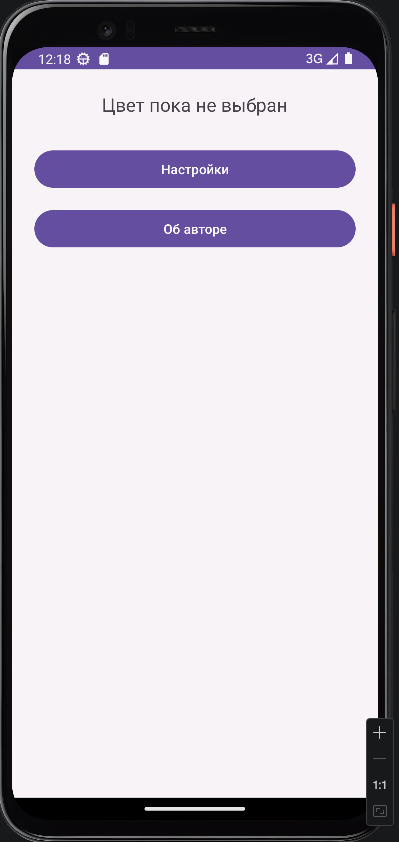
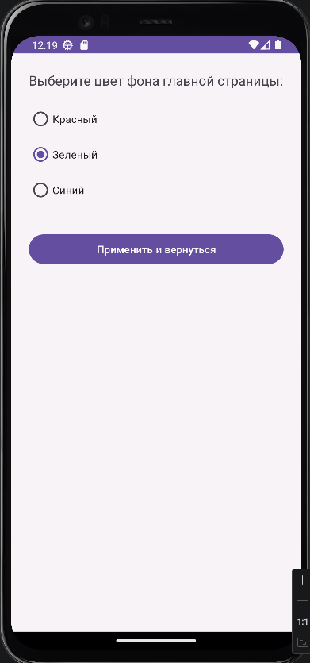
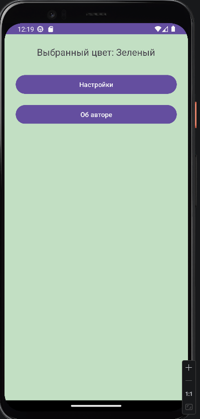
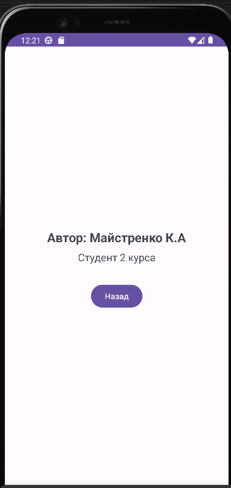

<div align="center">

# Отчет

</div>

<div align="center">

## Практическая работа №5

</div>

<div align="center">

## Работа с несколькими окнами (Activity)

</div>

**Выполнил:**
Майстренко Константин Александрович
**Группа:** инс-б-о-24-2

---

### Цель работы

Научиться создавать многоэкранные приложения, осуществлять навигацию между `Activity` и передавать данные между экранами с использованием объектов `Intent` и механизма `startActivityForResult` / `onActivityResult`.

### Ход работы

В ходе выполнения практической работы было создано Android-приложение, состоящее из нескольких экранов (`Activity`).

Сначала была реализована главная активность приложения (`MainActivity`), содержащая элементы интерфейса для перехода к экрану настроек и экрану с информацией об авторе. На главном экране также был размещён элемент, внешний вид которого изменялся в зависимости от выбранных пользователем настроек.

Далее была создана активность `SettingsActivity`, предназначенная для выбора параметров отображения. Для перехода на этот экран использовался **явный Intent**, так как запуск выполнялся внутри собственного приложения. После выбора нужного параметра результат передавался обратно в главную активность с помощью `Intent`, `setResult()` и `finish()`.

Затем была создана активность `AboutActivity`, содержащая информацию об авторе работы. Переход на этот экран осуществлялся обычным методом `startActivity()`, так как возврат данных в этом случае не требовался.

После этого в `MainActivity` была реализована обработка результата, возвращаемого из `SettingsActivity`, через метод `onActivityResult()`. Полученные данные использовались для изменения состояния главного экрана в соответствии с выбранным вариантом задания.

В самостоятельной части был реализован собственный вариант настроек, а также организована навигация между тремя экранами приложения: главным экраном, экраном настроек и экраном «Об авторе».

Ниже приведены скриншоты выполнения работы.

<div align="center">


*Рисунок 1. Главный экран приложения*

</div>

<div align="center">


*Рисунок 2. Экран выбора цветов приложения*

</div>


<div align="center">


*Рисунок 3. Результат применения выбранных настроек на главном экране*

</div>

<div align="center">


*Рисунок 4. Экран «Об авторе»*

</div>

### Вывод

В результате выполнения практической работы были изучены основы построения многоэкранных Android-приложений.
Я научился создавать несколько `Activity`, настраивать переходы между экранами, передавать данные с помощью `Intent`, а также возвращать результат из одной активности в другую.
Практическая работа позволила лучше понять организацию навигации в Android-приложениях и взаимодействие между отдельными экранами.

### Ответы на контрольные вопросы

1. **Что такое Intent? Какие существуют типы Intent (явные и неявные)? Приведите примеры использования каждого типа.**
   `Intent` — это объект, который описывает намерение выполнить некоторое действие. В Android он используется для запуска активностей, сервисов и передачи сообщений.
   Существуют два основных типа `Intent`:

   * **явный (`explicit`)** — когда точно указывается, какой компонент нужно запустить;
   * **неявный (`implicit`)** — когда задаётся только действие, а Android сам подбирает подходящее приложение.

   Пример явного `Intent`:

   ```java
   Intent intent = new Intent(MainActivity.this, SettingsActivity.class);
   startActivity(intent);
   ```

   Пример неявного `Intent`:

   ```java
   Intent intent = new Intent(Intent.ACTION_VIEW, Uri.parse("https://google.com"));
   startActivity(intent);
   ```

2. **Как передать данные из одной Activity в другую с помощью Intent? Какие ограничения на типы передаваемых данных существуют?**
   Данные передаются через методы `putExtra()` и затем считываются через `get...Extra()`.
   Пример:

   ```java
   Intent intent = new Intent(MainActivity.this, SecondActivity.class);
   intent.putExtra("NAME", "Константин");
   intent.putExtra("GROUP", "инс-б-о-24-2");
   startActivity(intent);
   ```

   Во второй активности:

   ```java
   String name = getIntent().getStringExtra("NAME");
   ```

   Обычно передаются примитивные типы, строки, массивы, а также объекты, реализующие `Serializable` или `Parcelable`.

3. **В чем разница между методами startActivity() и startActivityForResult()? В каких случаях используется каждый из них?**
   `startActivity()` используется, когда нужно просто открыть другой экран без возврата результата.
   `startActivityForResult()` используется, когда нужно открыть экран и затем получить от него данные обратно.
   Например, экран «Об авторе» можно открывать через `startActivity()`, а экран настроек — через `startActivityForResult()`.

4. **Опишите назначение методов setResult() и finish() в контексте возврата данных из дочерней Activity.**
   Метод `setResult()` нужен для подготовки результата, который будет передан обратно в родительскую активность.
   Метод `finish()` завершает текущую активность и возвращает пользователя на предыдущий экран.
   Обычно они используются вместе:

   ```java
   Intent resultIntent = new Intent();
   resultIntent.putExtra("COLOR", "blue");
   setResult(RESULT_OK, resultIntent);
   finish();
   ```

5. **Что произойдёт, если не зарегистрировать Activity в файле AndroidManifest.xml?**
   Если `Activity` не зарегистрировать в `AndroidManifest.xml`, приложение не сможет её открыть. При попытке запуска такой активности возникнет ошибка, и приложение завершится с исключением.

6. **Какие методы жизненного цикла Activity вызываются при переходе от MainActivity к SettingsActivity и при возврате обратно?**
   При переходе от `MainActivity` к `SettingsActivity` у главной активности обычно вызываются:

   * `onPause()`
   * `onStop()`

   У новой активности вызываются:

   * `onCreate()`
   * `onStart()`
   * `onResume()`

   При возврате обратно `SettingsActivity` завершается, а у `MainActivity` снова вызываются:

   * `onRestart()`
   * `onStart()`
   * `onResume()`

7. **Для чего используется requestCode в методе startActivityForResult()? Как обрабатываются несколько различных запросов в onActivityResult()?**
   `requestCode` нужен для того, чтобы понять, из какого именно запроса пришёл результат. Это особенно важно, если из одной активности запускается несколько разных экранов с ожиданием ответа.
   В `onActivityResult()` сначала проверяется `requestCode`, а затем уже обрабатываются данные:

   ```java
   if (requestCode == REQUEST_CODE_SETTINGS) {
       if (resultCode == RESULT_OK && data != null) {
           String value = data.getStringExtra("COLOR");
       }
   }
   ```

### Список литературы

1. Phillips, B., Stewart, K., & Marsicano, K. *Android Programming: The Big Nerd Ranch Guide* (5th Edition). Big Nerd Ranch Guides, 2022.
2. Документация Android Developers. Руководство по работе с Intent и Activity.
3. Гриффитс Д., Гриффитс Д. *Head First. Программирование для Android*. Питер, 2021.
4. Соколова В. В. *Разработка мобильных приложений на платформе Android*. М.: Юрайт, 2021.
5. Мэрфи М. *Основы Android программирования на Java*. СПб.: БХВ-Петербург, 2019.
